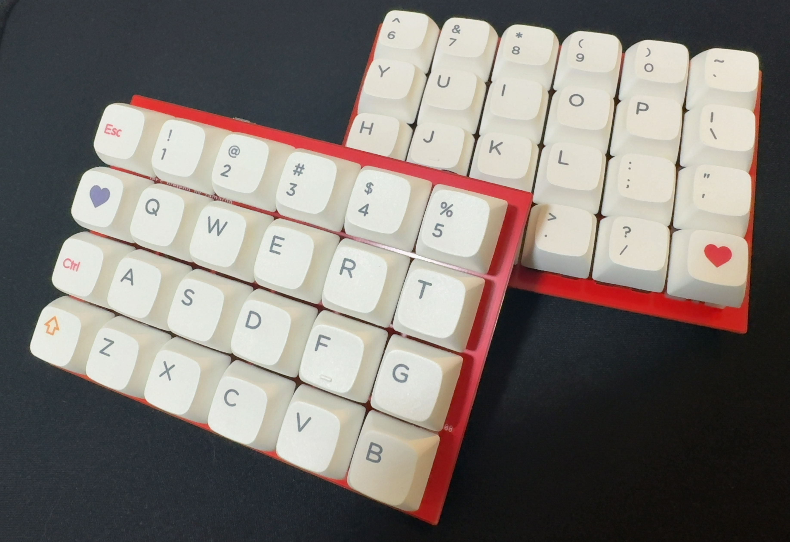
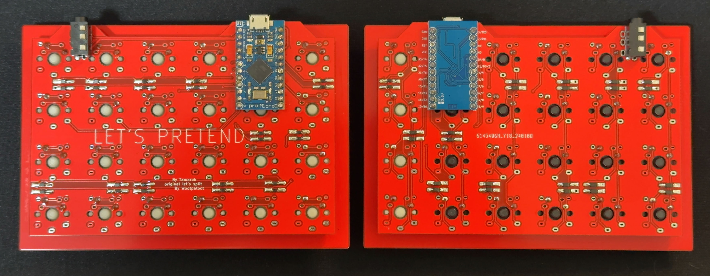
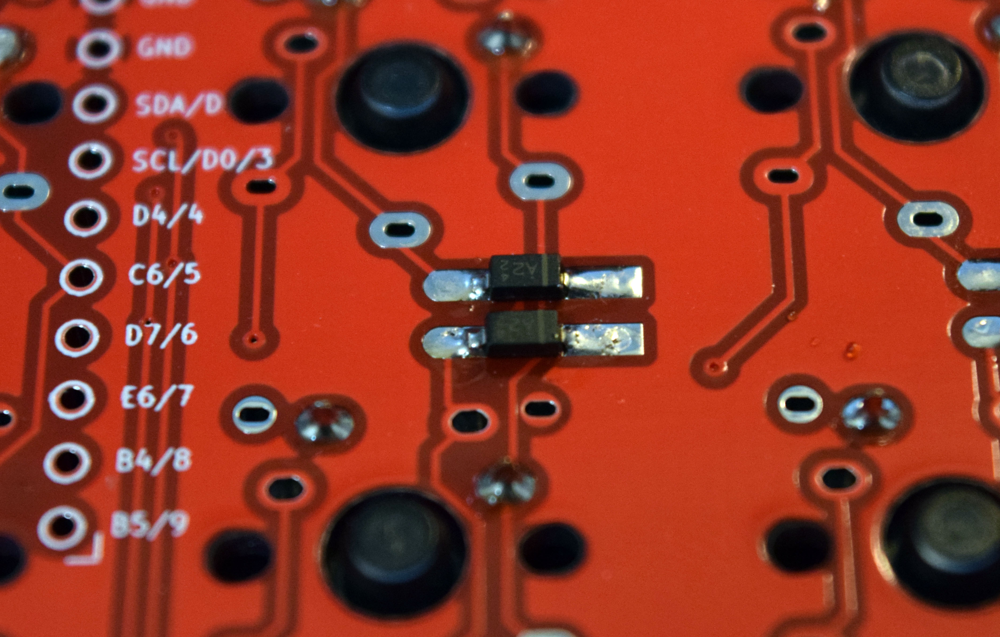
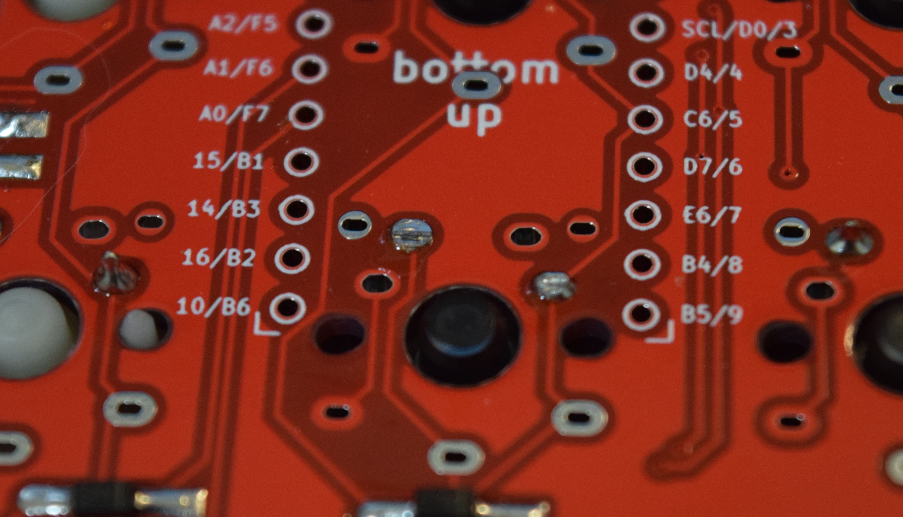

# Let's Pretend
let's pretendは分割型のオーソリニアキーボードです。
オリジナルデザインはWootpatootによるLet's Splitです。

## 必要なもの
| 部品 | 数量 | 説明 |
|---------|---------|---------|
| PCB | 2 | 左右両方のデザインに使用できます |
| キープレート | 1 | データ6 |
| Pro Micro | 2 | コンスルー推奨 |
| TRRSコネクター | 2 |  |
| TRRSケーブル | 1 | TRS（3ピン）も使用可能 |
| スイッチ | 48 | Cherry MXまたはKailh choc V1、V2対応 |
| キーキャップ | 48 | 1Uのみ |
| ケース | 2 | このリソースには含まれていません。Let's Splitのケースが適合するかもしれません |
| USBケーブル | 1 | USBA-MicroB |

## 作り方
1. 表裏を確認します。裏から見て "LET'S PRETEND" の印字がある方が左側になります。右側は裏返してください。
   
2. ダイオード、TRRSコネクターを半田付けします。ダイオードには向きがあります。
   
3. キープレートにスイッチを差し込み、PCBを半田付けします。（この作業からやり直すのが難しくなりますので慎重に作業を進めてください）
4. Pro Microにコンスルーを半田付けします。左右で表裏が異なるので確認して行ってください。
5. Pro Micro装着部に重なるスイッチの端子は、Pro Microにぶつかる場合は切り落としてください。
   
6. Pro Microを装着します。
7. USBケーブルを接続して、ファームウェアを書き込みます。[QMKのドキュメント](https://docs.qmk.fm/newbs_flashing)などで方法を確認してください。両方とも行ってください。
8. TRRSケーブルを接続し、USBケーブルを左側に接続してください。
9.  完成です。キーマップを編集するときはRemapを使用してください（JSONファイルをアップロードして利用が可能です。）
## リソース
[ファームウェア](tamaroh_lets_pretend_default.hex)

[Remap / VIA 用 JSONファイル](lets_pretend_via.json)
