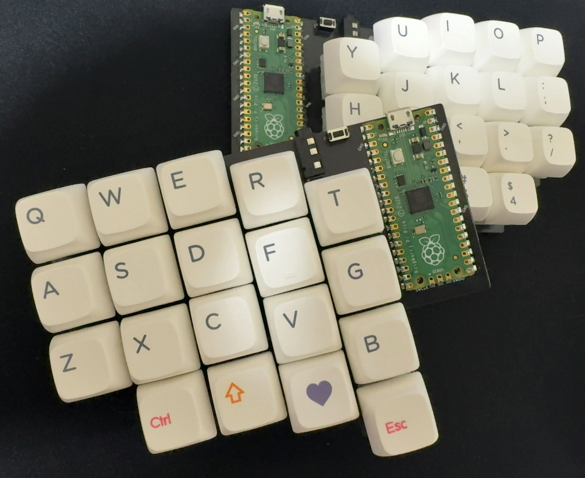

# maggie38sr

38キー、Raspberry Pi Pico採用の分割キーボードです。
## 必要なもの
| 部品 | 数量(両手分) | 説明 |
|---------|---------|---------|
| PCB | 2 | 左右異なるPCBです |
| Raspberry Pi Pico | 2 | コンスルー推奨 |
| タクトスイッチ | 2 | リセットボタン |
| TRRSコネクター | 2 |  |
| TRRSケーブル | 1 | TRS（3ピン）も使用可能 |
| スイッチソケット | 38 | Cherry MXのみ対応 |
| キースイッチ | 38 | Cherry MXのみ対応 |
| キーキャップ | 38 | 1Uのみ |
| USBケーブル | 1 | USBA-MicroB |

## 作り方
1. ダイオード、TRRSコネクター、タクトスイッチ、ソケットを半田付けします。
2. コンスルーを使用する場合、Raspberry Pi Picoに半田付けします。
3. 基板にRaspberry Pi Picoを差し込みます（コンスルー不使用の場合半田付けします）
4. BOOTSELスイッチを押したままUSBケーブルを接続し、ファームウェアを書き込みます。[公式ドキュメント](https://www.raspberrypi.com/documentation/microcontrollers/pico-series.html#resetting-flash-memory)などを参考にしてください。
5. 完成です。キーマップを編集するときはRemapを使用してください（JSONファイルをアップロードして利用が可能です。）

## ファームウェア

[ファームウェア](./tamaroh_maggie38sr_default.uf2)

[Remap / VIA 用 JSONファイル](./maggie38sr.via.json)

[レイアウトデータ](https://www.keyboard-layout-editor.com/#/gists/450e32e83925615fe3a56782792e0b92)（キープレートやケース等の参考にしてください。スイッチは19.05mmピッチで作成しています）

## おことわり

- 製作に関するサポートには応じておりません。あらかじめご了承ください。
- 不良品等の交換はできません。
